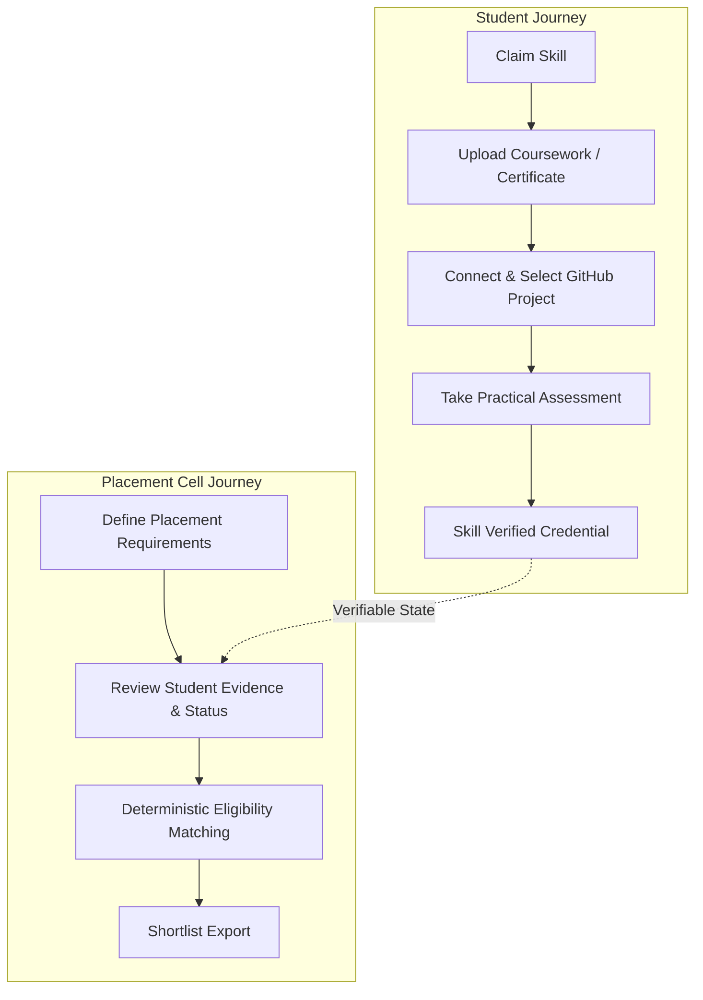

# ProofPath

> "Don't just claim your skills. Prove them."

ProofPath is an evidence-based campus placement verification platform connecting student skill claims with verifiable artifacts, practical assessments, and deterministic placement matching.

### Try the Prototype

[Download Android App →](https://expo.dev/artifacts/eas/8OYDsfi2TBhA-N2WwNpgR6XuIxeegEAB6RACLoJ6HUM.apk)

[Open Placement Dashboard →](https://proof-path-1r11ia88r-proof-path2.vercel.app)

[View Source on GitHub →](https://github.com/GitCrafted-1806/ProofPath)

### Demo Credentials

| Role | Interface | Email | Password |
| :--- | :--- | :--- | :--- |
| **Student** | Android Mobile App | `john.doe@nit.edu` | `Password123!` |
| **Placement Cell** | Web Dashboard | `coordinator@college.edu` | `Password123!` |

---

## Quick Evaluation

Follow these steps to evaluate the live prototype end-to-end:

### Student App (Android)
1. Download and install the APK on an Android device or emulator.
2. Log in as John Doe (`john.doe@nit.edu` / `Password123!`).
3. Open **Skills** &rarr; select **Python**.
4. Tap **Connect & Select GitHub Project**.
5. Select the prepared demo repository (`octocat-dev/analytics-pipeline`).
6. Complete the practical assessment under **Assessments**.
7. Open the **Verification Profile** to view the verified credential.

### Placement Cell (Web Dashboard)
1. Open the web dashboard.
2. Log in as placement coordinator (`coordinator@college.edu` / `Password123!`).
3. Open **Student Directory**.
4. Select **John Doe** to inspect submitted evidence, linked repositories, and verified skills.
5. Navigate to **Requirements** &rarr; select a placement requirement defined by the placement cell.
6. Run placement matching to view the deterministic eligibility result.

---

## What is ProofPath?

On traditional campus placement portals, students claim proficiency by listing unverified keywords on resumes. Placement cells have no reliable way to verify whether a student can write code, work with core libraries, or build functional projects until interviews take place.

ProofPath replaces self-declared keywords with an evidence pipeline:

$$\text{Skill Claim} \longrightarrow \text{Evidence} \longrightarrow \text{GitHub Project} \longrightarrow \text{Practical Assessment} \longrightarrow \text{Verification}$$

Once skills are verified through multi-factor criteria, the placement cell defines placement requirements (eligible branches, minimum CGPA, required verified skills) and runs deterministic eligibility matching. Students who meet the criteria are identified transparently without arbitrary leaderboard ranking.

---

## Product Workflow



---

## Verification Model

ProofPath organizes each technical skill through four verification levels:

1. **`UNVERIFIED`**: The skill is claimed by the student during onboarding without supporting artifacts.
2. **`EVIDENCE_SUPPORTED`**: The student has attached an uploaded certificate, project documentation, or linked a relevant GitHub repository.
3. **`SKILL_ASSESSED`**: The student has completed a timed practical assessment demonstrating syntax and problem-solving.
4. **`SKILL_VERIFIED`**: Full verification criteria are met: supporting evidence attached, practical assessment passed, and repository linkage confirmed.

> **Important:** The final verification state is determined by deterministic backend rules. AI does not directly decide the final verification status.

---

## MVP Skills

ProofPath focuses on 4 foundational technical competencies for campus recruitment:

* **Python**: Core programming, control structures, object-oriented concepts, and algorithms.
* **Pandas**: Data manipulation, DataFrame querying, cleaning, and transformation.
* **Matplotlib**: Statistical plotting, custom visualization, subplots, and chart configuration.
* **Git/GitHub**: Branching, version control workflows, commit tracking, and repository architecture.

---

## Two Interfaces

ProofPath intentionally provides exactly two coordinated interfaces:

1. **Student Mobile Application** (Android): Built for personal skill progression, document upload, project linkage, and assessment taking.
2. **College Placement Cell Dashboard** (Web): Built for institutional coordinators to inspect evidence, establish placement requirements, match candidates, and export verified shortlists.

*Note: There is intentionally no recruiter or company portal in this prototype. ProofPath is designed specifically for the college placement office and student body.*

---

## Demo Environment

The deployed prototype runs in `DEMO_MODE` to provide evaluators with a consistent, reliable walkthrough without requiring external third-party service configurations.

The prepared demo account uses ProofPath's demo GitHub integration. Evaluators should use the supplied demo account rather than attempting to connect a personal GitHub account.

---

## Technical Overview

* **Student Mobile App:** React Native, Expo SDK 57, TypeScript
* **Placement Cell Dashboard:** Next.js (App Router), React 19, TypeScript, Tailwind CSS
* **Backend Service:** FastAPI, Python 3.12, Pydantic v2, SQLAlchemy 2.0
* **Database:** PostgreSQL (Supabase production), SQLite (local development)
* **Hosting:** Vercel (Web Dashboard), Render (FastAPI Backend), Supabase (Database)
* **Automated Tests:** 106 automated backend tests (pytest), TypeScript typechecks, and end-to-end integration suites

---

## Security and Privacy

* **JWT Authentication:** Stateless session management with role claims.
* **Role-Based Access Control (RBAC):** Strict separation between student and placement coordinator routes.
* **Student Ownership Isolation:** Students can only view and modify their own evidence; cross-student modifications are blocked.
* **Private Artifact Storage:** Uploaded evidence is stored in private storage with authenticated streaming downloads.
* **No Secrets Committed:** Sensitive tokens, keys, and database passwords are managed exclusively through environment variables.
* **Deterministic Rules:** Transparent, auditable state transitions without hidden heuristics.

---

## Repository Structure

```
ProofPath/
├── apps/
│   ├── student-mobile/
│   └── placement-web/
├── services/
│   └── api/
├── .env.example
├── .gitignore
└── README.md
```

---

## For Developers

Developer setup is optional and not required to evaluate the live prototype.

### Local Backend Setup
```bash
cd services/api
python -m venv venv

# Windows (PowerShell)
.\venv\Scripts\Activate.ps1

# Linux / macOS
source venv/bin/activate

pip install -r requirements.txt
pytest
uvicorn main:app --reload --port 8000
```

### Local Placement Web Setup
```bash
cd apps/placement-web
npm install
npm run dev
```

### Local Student Mobile Setup
```bash
cd apps/student-mobile
npm install
npx expo start
```
